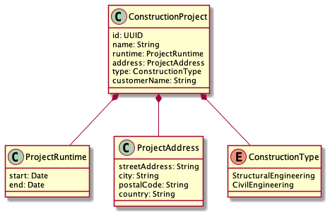

# react hooks assessment center
> Assessment center for web dev position at DDS docu tools team.

Fork this repository and implement a sample application as descirbed below. Use the UML class diagram as a data model for the described CRUD application.

## Summary

* Create CRUD single page web application for construction projects.
* The user should see a table of all construction projects in the storage.
* Creating new or editing existing construction projects should happen in a modal dialog. When completing the modal dialog, the table must be updated.
* The table should be searchable by a text searchbar.
* Make it possible to delete multiple records in the table at once.

## Technical Input

* Use functional components ([react hooks](https://reactjs.org/docs/hooks-intro.html) might be useful).
* You **don't have to write a backend/persistence layer** for this assessment center! Just store the data in-memory or in browser storage.
* Employ styled components for keeping a consistent style through the CRUD apps components.

## Non-Functional Requirements

* Add a Markdown file named `CONTRIBUTE.md` explaining:
  - How to build and run the application locally.
  - Document/explain the decisions you've made during the assessment.

## Class Diagram

